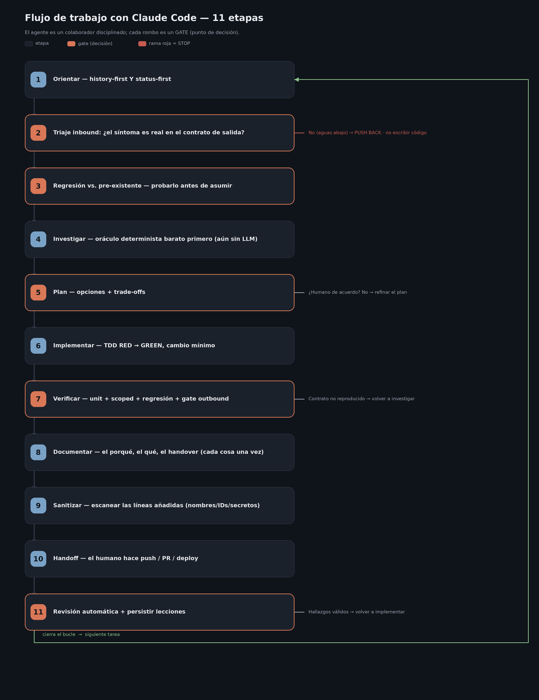

# Claude Code — Speaker guide (course in three parts)

> English version of [`GUIA_PRESENTACION.md`](./GUIA_PRESENTACION.md). The deck also exists in English: `presentacion/Claude_Code_Presentacion_EN.pptx`.

> Narrative guide for the course/workshop. It is written for the **speaker**: each section maps to a
> block of slides in the deck ([`presentacion/`](./presentacion/)) and includes the story to tell, the key
> points, and a slide-ready closing line 🗣️. Audience: **technical / developers**.
>
> The deck is **a single presentation** with **three distinct parts**:
> - **Part 1 — Claude Code:** the tool, from installation to agent teams.
> - **Part 2 — The methodology:** how you actually work with an agent in production. It is **tool-agnostic**
>   — it is demonstrated with Claude Code, but it travels to other agents (section 10).
> - **Part 3 — The ticket knowledge graph:** a complete case built with **graphify**
>   (not with CodeGraph): pipeline, commands created in Claude Code, real visualization, and how it
>   hooks into the methodology.
>
> The implementation detail (configs, copy-paste code) lives in [`GUIA_TECNICA.md`](./GUIA_TECNICA_EN.md)
> and in [`ejemplos/`](./ejemplos/). The [`docs/`](./docs/) folder is reference material from a real
> installation where the methodology is applied daily.

---

## Index

**Part 1 — Claude Code**

0. [What Claude Code is (framing)](#0-what-claude-code-is)
1. [Installation and basic usage](#1-installation-and-basic-usage)
2. [Memory, instructions, and sessions](#2-memory-instructions-and-sessions)
3. [Context: context window and prompt caching](#3-context)
4. [MCP — connecting your tools](#4-mcp)
5. [Plugins, tools, and skills](#5-plugins-tools-and-skills)
6. [Subagents and Agent Teams](#6-subagents-and-agent-teams)
7. [Automation](#7-automation)

**Part 2 — The methodology (agnostic)**

8. [The methodology: principle, workflow, and a real example](#8-the-methodology)
9. [The method's tools: CodeGraph, Serena, GSD…](#9-the-methods-tools)
10. [Transferring the methodology to another agent](#10-transferring-the-methodology)
11. [Machine synchronization](#11-machine-synchronization)

**Part 3 — The ticket knowledge graph (graphify)**

12. [The ticket knowledge graph](#12-the-ticket-knowledge-graph)
13. [Closing](#13-closing)

---

# PART 1 — Claude Code

## 0. What Claude Code is

**Story:** Claude Code is a coding agent that **reads your codebase, edits files, runs commands**, and
integrates with your tools. It is not autocomplete: it understands the whole project and works across
multiple files and tools. And **the same engine** runs in the terminal, IDE (VS Code/JetBrains), desktop
app, and browser — your `CLAUDE.md`, settings, and MCP servers work across all surfaces.

**What you can do with it (the headlines):**
- Automate the tedious parts: write tests, fix lint, resolve merge conflicts, update deps.
- Build features and fix bugs by describing them in natural language.
- Create commits and PRs; review code in CI.
- Connect your tools with MCP; run in Unix pipelines; schedule recurring tasks.

🗣️ *"It's not a copilot that suggests lines: it's a collaborator that plans, edits across files, and verifies."*

---

## 1. Installation and basic usage

**Story:** Installing is a one-liner. What matters is understanding the **two modes** of use.

**Installation (pick one):**
```bash
curl -fsSL https://claude.ai/install.sh | bash     # macOS / Linux / WSL (recommended, auto-update)
brew install --cask claude-code                     # Homebrew
winget install Anthropic.ClaudeCode                 # Windows
# also: apt / dnf / apk on Linux
```
Then, in any project:
```bash
cd tu-proyecto
claude            # first time it asks you to log in
```

**The two modes (the idea to make stick):**
- **Interactive** — you open `claude` and converse. This is where **plan mode** lives: Claude proposes a
  plan before touching anything and you approve it.
- **Headless (`-p`)** — a single prompt, in through stdin, out through stdout. This is what makes it
  **composable** Unix-style and automatable in CI:
  ```bash
  tail -200 app.log | claude -p "avísame si ves anomalías"
  git diff main --name-only | claude -p "revisa estos ficheros por seguridad"
  ```

**Surfaces:** terminal, VS Code/Cursor, JetBrains, Desktop (visual diffs, parallel sessions),
Web (claude.ai/code, long tasks with no local setup).

🗣️ *"Interactive to think with you; `-p` to drop it into a pipeline. Same Claude, two ways to invoke it."*

---

## 2. Memory, instructions, and sessions

**Story:** The agent is only as good as the context you give it — and how you **manage** it. Three
pieces: `CLAUDE.md`, settings, and sessions that travel across devices.

### `CLAUDE.md` — the project's memory
A Markdown file Claude reads at the start of **every** session. That's where you put code standards,
architecture decisions, commands, and checklists. It combines by **hierarchy**: user-global
(`~/.claude/CLAUDE.md`) → repo root → subfolders → personal `CLAUDE.local.md`.

**The classic mistake and how I solve it — the two-tier pattern:**
- **Tier 1 (always loaded):** small. Only orientation + **one-line pointers**.
- **Tier 2 (on demand):** the detail in files the agent reads only when needed.
- *Write-once* rule: each fact is written in a single place; the `CLAUDE.md` carries the pointer, not the copy.
- Real result: we trimmed ours **~73% without losing information**. (Sanitized example in
  [`ejemplos/claude-md/`](./ejemplos/claude-md/).)

**Auto-memory:** on top of that, Claude saves learnings on its own (build commands, debugging hints)
across sessions without you writing anything.

### Settings — permissions
`settings.json` controls what the agent can do via an **allowlist** (`allow`/`deny`/`ask`). A professional
setup does not use wildcards: it uses specific rules (e.g. the exact pytest invocation, scoped git
operations, concrete `mcp__*` tools). This is the "the human owns external actions" posture.

### Sessions that travel
Sessions are not tied to one surface: start on web/mobile and bring the session to the terminal with
`claude --teleport`; continue from your phone with **Remote Control**; hand a terminal session to the
**Desktop** app with `/desktop` to review diffs.

> ⚠️ **Platform caveat:** `/desktop` is only available in the **macOS and Windows** CLI (with a
> Claude subscription; not with an API key). If you run the CLI **inside WSL**, Claude Code sees it as
> **Linux** and the command **does not appear** — even if you have the Desktop app installed on Windows.
> In that case, open the project directly in the Desktop app (*Code* tab). `--teleport` and Remote
> Control do work from WSL.

🗣️ *"The always-loaded `CLAUDE.md` should be a 30-second onboarding, not a dumping ground. Pointers, not copies."*

---

## 3. Context

**Story:** This is the section that explains **why** the two-tier pattern from the previous section is not
an obsession: the context window is the resource that governs performance **and** cost. Two halves:
managing it (context window) and not paying for it twice (prompt caching). Material:
[`ejemplos/context/`](./ejemplos/context/) and [`ejemplos/prompt-caching/`](./ejemplos/prompt-caching/).

### 3a. Context window — the resource that governs everything

**What fills it before you type anything:** system prompt (~4.2k tokens), auto-memory (~680), environment
(~280), the MCP tools index, and your `CLAUDE.md`. After that: conversation, files read, command output.
The window is 200K tokens (1M in beta via API), but performance **degrades before you fill it** — noisy
context = worse decisions.

**The knobs:**
- `/context` — visualize usage, block by block. Measure before optimizing.
- `/compact [instructions]` — compact while steering what survives (*"focus on the API changes"*).
  Auto-compact kicks in on its own near the limit; getting ahead of it with focus is better (compaction is lossy).
- `/clear` — reset between unrelated tasks. Fresh context > a summary of noise.
- `/rewind` (Esc+Esc) — checkpoints: restore conversation, code, or both; condense stretches.

**Hygiene we actually apply:** minimal CLAUDE.md (two-tier); `@imports` and subfolder CLAUDE.md files
that load on demand; disable MCP servers you don't use; do research in **subagents** (section 6) so the
noise doesn't live in your session; targeted reads instead of "understand all of auth".

### 3b. Prompt caching — not paying for the same context twice

**The mechanism:** every turn resends ALL the context. The API caches the **stable prefix** (strict
order: `Tools → System → Messages`): writing cache costs 1.25× (2× at 1h TTL), **reading it costs
0.1×**. A 50-turn session rereads the prefix 50 times at a discount price.

**In Claude Code you configure nothing** — it applies it on its own. The **default TTL depends on
authentication**: **1 h with a subscription** (included in the plan) · **5 min with an API key**/Bedrock/Vertex;
it can be changed via env var (`ENABLE_PROMPT_CACHING_1H`, `FORCE_PROMPT_CACHING_5M`,
`DISABLE_PROMPT_CACHING`). Since every read renews the window, with a subscription a pause of up to 1 h
between turns still hits cache. And your decisions determine whether it hits:
- Small, **stable** CLAUDE.md → a prefix that never changes → hits.
- Editing CLAUDE.md/settings mid-session → invalidates the cache from that point on.
- Many MCP servers → large, changing tools block → expensive writes.
- `/compact` rewrites history → breaks the message cache once, then moves on.

Runnable demo with the API (watch the `cache_read_input_tokens` counters):
[`ejemplos/prompt-caching/cache_demo.py`](./ejemplos/prompt-caching/cache_demo.py).

**The bridge that joins 3a and 3b (and previews Part 2):** lean, stable context **performs better and
costs less at the same time**. And the methodology's "tool-precedence" (CodeGraph before reading files)
is, at bottom, context policy: maximum signal per token.

🗣️ *"The context window is your budget and prompt caching your discount: lean and stable wins on both."*

---

## 4. MCP

**Story:** **MCP (Model Context Protocol)** is the open standard for plugging Claude into external data
and tools: Drive, Jira, Slack, your database, a browser, your own tooling. Each server exposes *tools*
that show up as `mcp__<server>__<tool>`.

**The three scopes (where the config lives):**
- **local** → `.claude/settings.local.json` (only you, this machine).
- **project** → `.mcp.json` at the root, **versioned**, shared with the team.
- **user** → `~/.claude.json` (all your projects).

**Adding one:**
```bash
claude mcp add --transport http context7 https://mcp.context7.com/mcp
claude mcp list        # status
/mcp                   # inside the session: OAuth auth, tools
```

**The ones I use daily:** `serena` (semantic code navigation), `context7` (up-to-date library docs),
`playwright` (verify the UI in a real browser), `codegraph` (code graph), `supabase`.

**Best practices:** secrets via environment variable (never in the versioned JSON); server available
≠ tool allowed (you still control via the allowlist); and — this links to section 3 — **every server adds
context**: disable the ones the project doesn't use. Example config in [`ejemplos/mcp/`](./ejemplos/mcp/).

**The distinction to make stick:** servers **are not installed in the `CLAUDE.md`** — that file is
prompt, not configuration. The config (these three scopes, or a plugin) provides the **capability**; the
CLAUDE.md provides the **judgment** — the *trigger map* that makes the agent reach for the right tool
without being asked ("Serena before reading whole files"). Installing turns "I don't have the tool" into
"I have it"; the CLAUDE.md turns "I have it" into "it gets used in the right order" (that's the
precedence of Part 2).

🗣️ *"MCP turns Claude from 'knows code' into 'knows YOUR system': your docs, your tickets, your browser."*

---

## 5. Plugins, tools, and skills

**Story:** Four layers of extensibility, from simple to powerful.

1. **Tools** — what Claude can *do*: `Read/Edit/Write/Bash/Grep/Glob/WebFetch/Task` + the `mcp__*` ones.
   The built-ins are **compiled into the binary** (there's no tools folder to edit; they are sent as
   schemas on every request); only MCP and plugins *add* tools. What you manage is **access**:
   the permissions allowlist (which can also veto a built-in), `--allowedTools`/`--disallowedTools` flags,
   `PreToolUse` hooks as content-based veto, and each subagent's `tools:` frontmatter.
2. **Slash commands** — a `.md` in `.claude/commands/` = a `/command`. The body is the prompt.
   Example: [`/audit`](./ejemplos/skills-plugins/.claude/commands/audit.md) (npm audit → fix → tests).
3. **Skills** — package a repeatable flow in `.claude/skills/<n>/SKILL.md` with a `description`; Claude
   **auto-selects** it based on that description. Example: `deploy-staging`. Versus the slash command
   (which you invoke), a skill can carry scripts/templates and fires on its own.
4. **Plugins + marketplaces** — bundle skills + commands + agents + MCP + hooks as an installable unit:
   `/plugin marketplace add <owner/repo>` → `/plugin install <x>`. That's how you distribute a whole
   setup (GSD installs dozens of skills in one go).

### Slash command vs. skill vs. plugin — the difference in one table

| | **Slash command** | **Skill** | **Plugin** |
|---|---|---|---|
| **What it is** | A saved prompt | A repeatable capability with instructions + supporting files | A distributable package |
| **Where it lives** | `.claude/commands/<n>.md` | `.claude/skills/<n>/SKILL.md` (+ scripts/templates in the folder) | Installed into `~/.claude/plugins` from a marketplace |
| **How it's invoked** | **You**, by typing `/<n>` | **Claude auto-selects it** by its `description` | It isn't "invoked": it installs what's inside |
| **What it packages** | Just the prompt (accepts `$ARGUMENTS`) | Instructions + code/templates/references | skills + commands + agents + MCP + hooks |
| **Scope** | A short flow | A flow with assets | A whole setup |
| **Distribution** | Copy the file | Copy the folder (or via a plugin) | `/plugin install` (GSD, serena, context7… are plugins) |

The idea in one sentence: the **slash command is fired by you**; the **skill is decided by Claude** (via
its description); the **plugin is the delivery vehicle** for both — and for agents, MCP, and hooks — versioned.

🗣️ *"Slash command = a shortcut you invoke. Skill = a capability Claude decides to use. Plugin = both, distributable."*

---

## 6. Subagents and Agent Teams

**Story:** The fifth layer of extensibility deserves its own section: not extending *what Claude knows how
to do*, but **how many Claudes work and how they coordinate**. Three steps: built-in subagents → custom
subagents → agent teams. All the material (incl. the diagram) in [`ejemplos/subagents/`](./ejemplos/subagents/).

### 6a. Subagents (the `Task` tool) — isolating context

Claude launches **subagents** with their own context window: the messy research happens "outside" and
**only the summary** comes back to your session. Built-ins: `Explore` (read-only), `Plan`,
`general-purpose`. It's the context-hygiene mechanism from section 3 — and they can be launched **in
parallel** for independent work.

### 6b. Custom subagents — `.claude/agents/*.md`

A Markdown file with frontmatter (`name`, `description`, `tools`, `model`) + its own system prompt. The
`description` drives auto-selection (as with skills); `tools` is a per-agent allowlist; `/agents` lists
them. Scopes: user (`~/.claude/agents/`) or project (versioned). Two real examples:
- [`security-reviewer`](./ejemplos/subagents/.claude/agents/security-reviewer.md) — a reviewer with read-only tools.
- [`refactor-scout`](./ejemplos/subagents/.claude/agents/refactor-scout.md) — encodes the methodology's
  CodeGraph→Serena rule (Part 2) as an agent procedure.

**The gotcha to tell:** the subagent **does not inherit your conversation** — the necessary context goes
in the launch prompt.

### 6c. Agent Teams (experimental) — coordinating sessions

A **team** = one lead + teammates, each a **full session** of Claude Code, with a **shared task list**
(`~/.claude/tasks/<team>/`) and **direct messaging** between teammates (inboxes) — they can debate
findings, not just report upward. Enabled with `CLAUDE_CODE_EXPERIMENTAL_AGENT_TEAMS=1`; in-process
display or split-panes (tmux/iTerm2). Roles can reuse your custom subagents.

**When to use which (the decision slide):**

| | Subagent | Agent team |
|---|---|---|
| Context | Isolated; returns a summary | Each teammate = a full session |
| Communication | Result only → main session | Task list + messages between teammates |
| Cost | Low | High (N sessions) |
| Use it for | Side-quests: research, explore, verify | Real parallelism: multi-layer review, competing hypotheses |

Practical rules: 3–5 teammates; **partition the files** (each teammate owns theirs); full context in the
kickoff prompt. Limitations today: no in-process `/resume`, one team per session, no nested teams.

**Bridge to Part 2:** GSD (section 9) packages exactly this — `gsd-planner`, `gsd-executor`,
`gsd-verifier` are custom subagents distributed as a plugin (for multi-phase projects; **this project
uses the `data/changes/` flow, not GSD** — see the clarification in section 9).

🗣️ *"Subagent so the noise dies outside your session; team so several Claudes can debate. The cost is not the same."*

---

## 7. Automation

**Story:** Four levels, from deterministic control to full autonomy. (This is where the hooks course
shines — everything in [`ejemplos/hooks/`](./ejemplos/hooks/) and [`ejemplos/automation/`](./ejemplos/automation/).)

### a) Hooks — deterministic control
A hook is a shell command that fires **before/after** an agent action. You don't *ask* it to format: you
**force** it. Contract:
- Payload via **stdin**; events `PreToolUse`/`PostToolUse`/`SessionStart`/`Stop`/…
- **Matcher = regex over the tool name** (`Write|Edit|MultiEdit`, `Read|Grep`, `*`).
- **`exit 0` allows · `exit 2` BLOCKS** and returns stderr to Claude as feedback.
- Pre gives you the *intent* (`tool_input`, you can veto); Post gives you the *result* (`tool_response`).

Five example hooks, all real:
- **Security:** block reading `.env` (exit 2).
- **Observability:** dump every payload to a JSON file.
- **Quality (non-blocking):** `prettier --write` after every edit.
- **Quality (blocking):** type-check; if it doesn't compile, it cuts in and Claude fixes it in the turn.
- **Meta ("AI reviewing AI"):** a hook that calls the Agent SDK to detect duplicated code and veto it.

### b) Headless / piping — `claude -p` in any pipeline (see section 1).

### c) CI/CD — GitHub Actions / GitLab / GitHub Code Review. Automated PR and issue review.
   Example workflow in [`ejemplos/automation/github-action-claude.yml`](./ejemplos/automation/github-action-claude.yml).

### d) Scheduled tasks:
- **Routines** (`/schedule`) — run on Anthropic infrastructure even if you shut your machine down;
  triggerable via API or GitHub events.
- **Desktop scheduled tasks** — on your machine, with local access.
- **`/loop`** — fast polling inside a session.

### e) Agent SDK — for custom workflows: `query({ prompt, options: { allowedTools } })`.

🗣️ *"With instructions you ask it to behave; with a hook you guarantee it. `exit 2` is the 'no' Claude cannot ignore."*

---

# PART 2 — The methodology (tool-agnostic)

## 8. The methodology

**Story:** Tools without a method = fast chaos. This is the most valuable part of the course: **how you
actually work with a coding agent on a project in production.** It is not a perfect workflow — it is the
one we use, subject to constant revision. And it is **agnostic**: demonstrated with Claude Code, but the
discipline travels (section 10). All the material is in
[`ejemplos/metodologia/`](./ejemplos/metodologia/) (sanitized).

### The principle
> **The agent is a disciplined collaborator, not an autopilot. Autonomy is earned per-decision, not
> granted wholesale.** The agent owns research, plans, implementation, tests, and documentation;
> the human owns go/no-go decisions, scope, and **every external action** (push, PR, deploy).

### The 11-stage workflow



Chained by **gates** (the coral boxes in the diagram); a red gate is a STOP = *write no code*:

1. **Orient** — history-first AND status-first (`STATUS.md`/ledgers + `git`/`gh`). Skipping it is the #1 cause of rework.
2. **Inbound triage** — is the symptom real in the **output contract**? If not → push back, no code.
3. **Regression vs. pre-existing** — reproduce against the previous state before assuming blame.
4. **Investigate** — **deterministic oracle** (parser/validator) first; the LLM is reserved for verifying.
5. **Plan** — propose options + trade-offs; explicit **human agreement** before touching code.
6. **Implement** — TDD: RED (for the right reason) → GREEN, minimal change.
7. **Verify** — unit + scoped + regression + **outbound gate** (three checks): reproduce the contract at the
   **real output stage** (the *wrapper* that rebuilds the output, not an internal function), have the local
   JSON match, and verify it **inside the deployed image** — green tests don't prove what gets shipped.
8. **Document** — why + what + handover + acceptance criteria, each thing **once**.
9. **Sanitize** — scan the **added lines** for names/IDs/secrets/agent attribution.
10. **Handoff** — the human (or a tool of theirs, e.g. Cursor) does push/PR/deploy. The agent **never**.
11. **Automated review + persist** — triage the bot's findings like a human's; codify lessons.

> **Where is the cost? The agent is the orchestrator — and that's where the inference lives.** No stage is
> "free": the **tools** (`/kg`, `git`, parsers, `pytest`, `grep`) provide **facts with no inference**, but
> the agent **reads** those facts, **reasons**, and **decides** — and that costs. The method doesn't remove
> the cost, it **concentrates** it: cheap in 1–3 and 9 (reading facts + deciding), **expensive in 5–6–7**
> (plan, code, verify), where the model *thinks and creates*. Cost-per-stage table:
> [`metodologia/WORKFLOW.md`](./ejemplos/metodologia/WORKFLOW.md).

### A real example (see [`metodologia/EJEMPLO_REAL.md`](./ejemplos/metodologia/EJEMPLO_REAL.md))
Bug: *"a field shows up empty in the UI but it's in the PDF."* → Orient (STATUS.md finds a
`SHARP_EDGES` entry that constrains the fix) → confirm the empty value in the contract JSON (Playwright) →
pre-existing, not a regression → Serena+CodeGraph locate the end-of-provision detector, and a
deterministic `_diag_pdf.py` reveals the cause (overflow into a 2nd column) **without a single LLM call**
→ plan approved → RED test → fix keyed on the *structural property* (not on the client) → byte-identical
regression (no-op proof) + contract reproduced locally (via the *wrapper*) and **inside the deployed
image** → document → sanitize → the human does the push. A review-bot spots a left-column case → the test
is added and it goes into the `PLAYBOOK`.

🗣️ *"The agent orchestrates and that's where the inference lives; the expensive part concentrates in plan/code/verify, not in searching."*

---

## 9. The method's tools

**Story:** The workflow says *what* to do; this section says **with which tool and in what order** — and
what each one does. The rule lives in the project's `CLAUDE.md`: "having MCP installed" is not enough,
the agent must reach for the right tool **automatically**. Detail:
[`metodologia/herramientas.md`](./ejemplos/metodologia/herramientas.md).

### The precedence: cheap → expensive, deterministic → probabilistic

Actual rule (updated): *"for 'what is this / who depends on it / what do I touch', a `codegraph_explore`
**first** — source + call paths + blast radius + test-coverage flags in a single call
(treat the source it returns as ALREADY read, don't reopen it); Serena `find_referencing_symbols` for the
**precise** check before renaming/deleting; grep/Read only for literals."*

| Workflow stage | Tool |
|---|---|
| Orient (1) | `/kg` (ticket graph — **graphify**, Part 3) · `STATUS.md`/ledgers · `git` · `gh` (no inference) |
| Navigate / investigate (4) | **CodeGraph** `codegraph_explore` — source + paths + blast radius + coverage, in 1 call |
| Precise refactor-check (4-6) | **Serena** `find_referencing_symbols` — disambiguates by class; **mandatory** before renaming/deleting |
| Diagnose (4) | **Deterministic oracle** (parser, validator, `_diag_*.py`) — no inference, reproducible |
| Environment: logs, config (4) | **AWS CLI** — a first-class debugging tool (read-only) |
| Output contract (2, 7) | **Playwright** / F12 on the endpoint the consumer sees |
| Verify what's deployed (7) | **Docker** — repro inside the runtime image; green tests ≠ what gets shipped |
| Only at the end (7) | The **LLM** call — to *verify* the fix, not to diagnose |

> **"No inference" ≠ "free".** These stages don't fire the **model call** (the expensive, non-deterministic
> resource), but Claude does read their output — a **smaller, targeted** cost, like a `grep`'s, not zero.
> The expensive reasoning is paid **once** when building the graph / the oracle and is **amortized** on every
> use (the ROI: no inference per query, deterministic and reproducible results, time and money saved).

### What each tool is (one sentence each, then a dedicated slide for the big three)

- **CodeGraph** ([`ejemplos/codegraph/`](./ejemplos/codegraph/)) — a **local, no API keys**
  tree-sitter→SQLite index; one query (`codegraph_explore`) returns source + call paths + blast radius +
  **test-coverage flags** (58% fewer tool calls in its benchmarks). It is the **first** navigation tool;
  the default project is pinned with `--path` in the MCP config (or pass `projectPath` for another repo —
  we also index `monolith` and `frontend` already). Phases: **investigate/navigate**.
- **Serena** ([`ejemplos/serena/`](./ejemplos/serena/)) — **semantic navigation via LSP**: symbols, not
  text. `find_referencing_symbols` disambiguates same-named methods by class — the **precise** check that
  CodeGraph's flat `impact` doesn't give. Complementary, not rivals. Phases: **investigate → implement**
  (pre-rename/delete).
- **GSD** ([`ejemplos/gsd/`](./ejemplos/gsd/)) — the method **productized**: a *discuss → plan
  → execute → verify* cycle with state in `.planning/` and subagents (`gsd-planner`, `gsd-plan-checker`,
  `gsd-executor`, `gsd-verifier`…), which automate the **plan (5) → implement (6) → verify (7)** phases.
  **Honesty — this project does NOT use GSD:** it runs the 11-stage workflow + `data/changes/`, **more
  refined and focused** on our work (per-ticket fixes on a service in production). GSD makes more sense in
  **a different kind of project** — a multi-component *greenfield* (designing a whole application, roadmap →
  phases) —; here we show it as the same discipline **productized** and as a living example of Part 1
  (custom subagents + skills as a plugin).
- **Playwright** — reproduces the symptom where the consumer sees it (phases **triage and outbound gate**).
- **Context7** — up-to-date library docs, instead of the training cutoff (phase **investigate**).
- **Home-grown deterministic oracles** (`_diag_*.py`) — the cheap, reproducible answer before spending
  the LLM call (phase **investigate**). **They are not skills or MCP tools:** they are **loose code** the
  agent types and runs with Bash, gitignored under `data/changes/<ticket>/` (unlike `/kg`/Serena/CodeGraph,
  which are registered capabilities). Detail: [`metodologia/herramientas.md`](./ejemplos/metodologia/herramientas.md).

🗣️ *"The classic inversion — pulling the model in to diagnose — is exactly what this order avoids: the model verifies; the oracles diagnose."*

---

## 10. Transferring the methodology

**Story:** The proof that Part 2 is **agnostic**: the method is packaged as a *starter-kit* and genuinely
transferred to **GitHub Copilot** in another repo. Real material:
[`docs/ai-agents-code-methodology/`](./docs/ai-agents-code-methodology/) (adaptation guide, templates,
bootstrap).

### What travels unchanged (the 5 rules to preserve)
1. Plan → agreement → implement.
2. Verify against the **consumer-visible contract**, not internal functions.
3. Solve the **general class** of the problem, not one sample input.
4. Durable trail of decisions (why, what changed, how it was verified).
5. The human owns irreversible external actions (merge, deploy, communication).

### What gets re-mapped per repo
The **contract** (HTTP payload / DB row / event / artifact), the **tracker** (Jira/Azure
Boards/Issues), the **test pyramid**, the deployed **runtime** (container/VM/serverless), and the local
**sanitization** rules.

### What gets substituted (tools are fungible; the discipline is not)
Serena/CodeGraph/`/kg` are *implementations*. Without a ticket graph there is a **documented
deterministic fallback**: newest-first `STATUS.md` + per-ticket folders + lexical search by symptom +
commit history as a lightweight graph substitute + a "danger zones" section. 80% of the value with
minimal setup.

### The kit (see [`TRANSFER_AND_BOOTSTRAP.md`](./docs/ai-agents-code-methodology/TRANSFER_AND_BOOTSTRAP.md))
Templates for `STATUS`/`SHARP_EDGES`/`HANDOVER`/`QA_ACCEPTANCE`/working-agreement + a
`bootstrap-new-repo.ps1` script that creates the structure in the target repo. The operating model with
Copilot is the same gated workflow: load orientation → triage on the contract → deterministic probes →
plan gate → TDD gate → outbound gate → handover. First-day checklist: fill in `STATUS.md`, 3-5 initial
invariants, define the contract, scoped test commands, and **one complete issue with RED → GREEN + contract**.

🗣️ *"If you keep only five rules, keep those five. Tools get replaced; the discipline travels."*

---

## 11. Machine synchronization

**Story:** The same principles of the methodology applied to **ops**: moving the workspace between the
main machine and the laptop with a real runbook (see
[`metodologia/machine-sync.md`](./ejemplos/metodologia/machine-sync.md)). It shows the methodology is not
just for code:

- **Asymmetric synchronization:** outbound = **full copy** (one tarball: workspace + `~/.claude`/`.aws`/
  `.ssh`, with `-h` to dereference symlinks, excluding venvs/node_modules); inbound = **delta only**
  (the code is already on GitHub → `git fetch`; only the gitignored docs in `data/`, a few MB, travel).
- **Copying to USB has real gotchas:** WSL does not auto-mount a USB plugged in after boot
  (`sudo mount -t drvfs F: /mnt/f`); and the copy is **verified byte by byte** (`stat -c %s` on source and
  destination match) before ejecting — evidence, not "looks like it fits". The bundle **grows**
  (~0.9→~1.5 GB); size the USB up.
- **Durable memory, on demand:** the runbook does **not** live in the always-loaded `CLAUDE.md` — there is
  a one-line pointer; it loads only when you travel.
- **The landing is driven by an agent with guardrails:** the delta's `INSTRUCTIONS.md` is written *for an
  agent*; non-destructive only (rename, don't delete), `git fetch` is the only network op, backup+`diff` of
  `STATUS.md`, and **STOP and ask** if the main machine made its own edits. The human approves; the agent
  does no push/merge.
- **"Discover, don't assume":** the commands **derive** the workspace root (`ls -d /mnt/*/ILS`), they
  don't hardcode it, because paths differ per machine.
- **The tooling syncs too:** the `.codegraph/` index is **excluded** from the tarball (it's local, with
  absolute paths) and rebuilt at the destination; an idempotent `target-setup.sh` reinstalls the CodeGraph
  CLI, updates GSD only if it's behind, and **corrects the MCP `--path`** to the laptop's real root.
- **Bring-up and memory, with idempotent subcommands:** on a new laptop, `kg_refresh.sh bootstrap`
  installs what doesn't go in the bundle and verifies `/kg`; and since memory (`~/.claude`) does **not**
  travel in the delta, `snapshot-memory` parks it under `data/` so it travels and `restore-memory` merges
  it back (with backup) before `/kg-refresh`. A `LAPTOP_START_HERE.md` is the single entry point for the
  laptop's agent.

🗣️ *"The methodology isn't just for code: durable memory, guardrails, and 'the human owns external actions' — in ops too."*

---

# PART 3 — The ticket knowledge graph (graphify)

## 12. The ticket knowledge graph

**Story:** A complete case, from idea to tooling in production. If CodeGraph indexes the *code*, this
graph indexes the **project's memory** — per-ticket writeups, "sharp edges", runbooks, memory notes —
and answers *"what broke before near here?"* in one call, **with no LLM**. The technology that builds it
is **graphify** (not CodeGraph — CodeGraph is only the *analogy*: same role, different domain, different
tool). All the real material is in [`docs/knowledge-graph/`](./docs/knowledge-graph/): design,
scripts, tests, manifest, and the real output ([`output/graph.html`](./docs/knowledge-graph/output/graph.html)).

### 12a. The problem and the design (see [`docs/knowledge-graph/design.md`](./docs/knowledge-graph/design.md))

In a repo with **~540 files** of writeups, a "new" bug almost always has prior context that constrains
the fix: an invariant, a ticket that fixed something similar, a documented regression. Finding it by hand
= remembering it exists + grep. The graph makes it **explicit and queryable**.

- **A curated corpus, not a glob:** a **diffable** [`manifest.txt`](./docs/knowledge-graph/manifest.txt)
  enumerates exactly what goes in (~116 files, ~196k words): `sst-*` writeups (with a deterministic
  fallback for folders without a primary doc), hubs (`STATUS`, `SHARP_EDGES`, `PLAYBOOK`…), extractor
  status, ops runbooks, and the `~/.claude` memory.
- **Hard exclusions:** binaries, handovers that repeat the ticket, repetitive QA and — critically — the
  **stale copies** from a travel tarball (`payload/`): including them would create duplicate/conflicting
  nodes. *Density without new knowledge = noise.*
- **Phase 1 was a spike with a decision at the end** (keep/extend/replace): validate whether off-the-shelf
  `graphify` was enough before investing in custom extraction. It was — and it stayed.

### 12b. The pipeline and the commands created in Claude Code

Two **skills** (`/kg`, `/kg-refresh`) + two deterministic **scripts**
([`kg_query.sh`](./docs/knowledge-graph/kg_query.sh), [`kg_refresh.sh`](./docs/knowledge-graph/kg_refresh.sh))
+ two corpus utilities (`build_manifest.py`, `stage_corpus.py`) + **tests** (`test_kg_*.py`):

```
kg_refresh.sh prepare   # build_manifest -> stage _corpus/ (names with provenance:
                        #   sst-5468__sst-5468.md, hub__STATUS.md, memory__x.md)
                        #   -> copy to a SCRATCH OUTSIDE the repo
/graphify <scratch>     # the only step with an LLM (subagents in parallel): extraction
                        #   of nodes/edges + clustering -> HTML/JSON/report
kg_refresh.sh finalize  # copy artifacts to output/ + leak-check (nothing outside data/)
```

- **The gotcha that underpins it:** `graphify` respects `.gitignore` and all of `data/` is gitignored →
  running the detector in place finds **0 files**. That's why the corpus is staged in a scratch outside the repo.
- **Why `/kg-refresh` is a skill and not a script:** the semantic step (`/graphify`) is a Claude step;
  the bookends (`prepare`/`finalize`) are deterministic and tested.
- **Command or skill? A skill, even though it's invoked with `/`:** it carries assets (the wrappers), has a
  `description` so Claude auto-selects it when orienting, and orchestrates a model step. The `SKILL.md`
  files live **at the user level** (`~/.claude/skills/kg/`, `kg-refresh/`, `graphify/`), outside the repo —
  for confidentiality (nothing from the KG in committable paths) and for scope (available machine-wide).
  They travel between machines inside the `~/.claude` tarball (section 11).
- Extra subcommands for the between-machines trip: `bootstrap` (new laptop), `snapshot-memory` /
  `restore-memory` (memory doesn't travel in the delta — it's parked under `data/` and merged back).

### 12c. The real output (see [`output/GRAPH_REPORT.md`](./docs/knowledge-graph/output/GRAPH_REPORT.md) and the slide with the visualization)

The project's real graph (captured from `output/graph.html`, an interactive vis-network with search,
node panel, and community filter):

- **507 nodes · 672 edges · 35 communities** over 116 files (~196k words).
- **92% `EXTRACTED` edges** (literal quotes, reliable) · 7% `INFERRED` (semantic similarity,
  mean confidence 0.7 — leads to verify, not facts).
- The **communities map to real danger zones**: "Letter-End & Run-in Titles", "Title Detection
  Failures", "Comment-Memo Boundaries", "PDF Extractor Cascade"… — exactly the clusters a senior
  engineer holds in their head.
- The **god-nodes** (most connected nodes) are the project's structural tickets — the report's top-10 is
  a free onboarding list.
- The report includes **"surprising connections"**: pairs of semantically twin lessons no one had
  connected by hand.

### 12d. How it's used and where it hooks in

```bash
/kg <ticket|tema>     # a node's neighbors   (graphify explain)  ← the most common use
/kg <A> <B>           # shortest path A<->B (graphify path)
/kg find <substr>     # discover a node's exact name
/kg-refresh           # rebuild after new tickets (cheap, re-runnable)
```

Fuzzy matching: `SST-1234`, `get_letter_end`, `"letter-end"` all resolve. **Deterministic, no LLM in the
query**: `kg_query.sh` reads `output/graph.json` directly. Real example: for an end-of-letter fix,
`/kg get_letter_end` instantly returns the full danger zone — the 5-6 tickets that share that code.

> **"No LLM in the query" is not "free" — it is a smaller, amortized cost.** The expensive inference (the
> extraction with subagents) is paid **once** in `/kg-refresh`; each `/kg` is then a deterministic
> algorithm over `graph.json` → **zero inference**. The only cost is Claude reading a small output (like a
> `grep`): smaller and targeted, not zero. Building the graph is thus an **investment** that amortizes: no
> inference per query, **deterministic and reproducible** results (a better outcome), and time and money
> saved per task. 🗣️ *"The graph isn't an expense: reason once, retrieve a thousand times."*

**Where it hooks in:** at **stage 1 (Orient)** of the methodology — the *history-first* rule in the
`CLAUDE.md` says **run `/kg <ticket|tema>` before grepping** in `data/changes/`. The graph points to
*what to read*, it doesn't replace it. And it is a **derived artifact**: it never travels between
machines; it is rebuilt wherever the corpus is (section 11). Confidentiality: the nodes carry internal
names → the whole tree lives under gitignored `data/`; sharing it externally would require a separate
sanitization pass.

🗣️ *"One semantic step at build time, zero LLM at query time. The graph is the map; the agent, the guide."*

---

## 13. Closing

**Part 1 — the tool:** installing is trivial; the value is in **how** you use it. The layers:
**install → memory/sessions → context & caching → MCP → skills/plugins → subagents/teams →
automation.** The context window is the budget; hooks and permissions are the guarantees.

**Part 2 — the method:** a powerful agent without a method is fast chaos. The 11-stage workflow channels
the power through **deterministic gates**; the tools (CodeGraph, Serena, the oracles) embody the
cheap→expensive precedence — with GSD as the **productized** version of the method —; and the discipline
**travels** — to another repo, to another agent, even to ops.

**Part 3 — the ticket graph:** the complete case that joins the two parts — Claude Code skills and
subagents (Part 1) in service of the methodology's *history-first* step (Part 2), built with
**graphify**: 507 nodes, 672 edges, 35 communities that map to real danger zones.

**The level-up:** from "chatting with an assistant" to **a system**: hooks that guarantee quality, MCP
that connects your world, subagents that scale the work, and a methodology that treats the agent as a
collaborator with evidence gates.

**References:** official documentation <https://code.claude.com/docs> · GSD
<https://github.com/tomascortereal/claude-code-setup> · CodeGraph <https://colbymchenry.github.io/codegraph/> ·
Serena <https://github.com/oraios/serena>.
