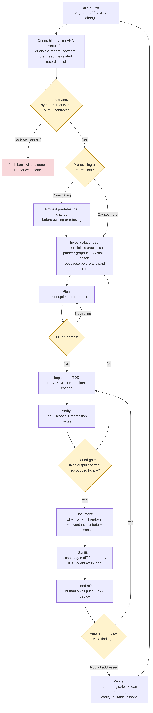

# Building a successful development environment with AI agents

> **Audience:** any developer or team curious about how we work with AI
> coding agents day-to-day. **Status:** a description of *how we proceed*,
> shared generically. It is **not a mandate** — take what's useful, adapt
> the rest, ignore what doesn't fit your stack. The value is in the
> *shape* of the workflow and the guardrails, not the specific tools.
>
> **This revision (latest)** adds five things we learned the hard way since
> the first draft: discriminate a *pre-existing* defect from one you just
> caused before owning it; confirm root cause with a **free, deterministic**
> probe before spending on an expensive model run; treat an **automated
> reviewer** as a first-class loop participant; **sanitise** every change of
> names/IDs/attribution before handing it off; and keep the agent's
> always-loaded context **lean** — write each record once, push detail to
> on-demand references. They're woven into the sections below.

---

## TL;DR

An AI agent is fast, tireless, and good at breadth — but left unguarded it
will confidently make plausible-but-wrong changes, over-fit to the one
reported case, and claim success it hasn't verified. The methodology below
exists to convert that raw capability into **reliable** output by keeping a
human in the decision loop and forcing the agent through a small set of
gates: *plan before code, verify against a contract, fix the general case,
prove it before claiming done, and leave a durable trail.*

The agent does the breadth-heavy work (investigation, drafting, tests,
docs); the human owns the **decisions** and the **outward-facing actions**
(what to build, and anything that touches production, customers, or shared
repos).

---

## Companion guides

- `COPILOT_ADAPTATION.md` - how to apply this methodology in a completely
   different repository using GitHub Copilot agent workflows, including a
   no-knowledge-graph fallback and technology-agnostic planning templates.
- `START_HERE.md` - quickest path to use this folder as a transfer-ready
   package.
- `TRANSFER_AND_BOOTSTRAP.md` - exact commands to zip, move, unpack, and
   initialize docs in the target repo.
- `NEW_REPO_CONFIGURATION_PLAN.md` - phased rollout plan for the first two
   weeks.
- `PACKAGE_MANIFEST.md` - inventory of all artifacts included in this pack.

---

## The mental model

| | Agent | Human |
|---|---|---|
| **Good at** | Reading lots of code fast, drafting, exhaustive checks, parallel exploration, never getting bored | Judgment, priorities, accountability, knowing what "good" means for the business |
| **Owns** | Investigation, plans, implementation, tests, documentation | The go/no-go decisions, scope, and every external action |
| **Default posture** | Propose, evidence, wait for agreement | Decide, gate, approve |

The single most important idea: **the agent is a disciplined collaborator,
not an autopilot.** Autonomy is earned per-decision, not granted wholesale.

---

## The environment (what to set this up with)

You don't need a specific vendor's tools — these are *roles* to fill:

1. **An orientation document** the agent reads first, every session. It
   states the architecture, the conventions, the "locked decisions" (things
   that look refactorable but must not be touched, with the reason), and the
   working rules. This is the agent's onboarding doc — and it pays for
   itself the first time it stops the agent from "helpfully" unifying two
   things that are deliberately split. **Keep it lean.** It is loaded on
   *every* turn, so it costs tokens continuously; let it grow into a
   per-change ledger and you pay that tax forever. It should hold
   orientation and *pointers* — not the full history. (We cut ours ~73% once
   it had bloated, with zero information loss, by moving detail to the
   on-demand files below.)
2. **Persistent memory** across sessions: current state (branch, what's
   in-flight), user/team preferences, and decisions with their rationale.
   So a fresh session resumes instead of re-onboarding. Same discipline as
   the orientation doc — a **live snapshot plus an index of open issues**,
   not a growing transcript.
3. **A tool layer** the agent reaches for automatically:
   - *Semantic navigation over both the code and the decision/lesson
     record* — a queryable index that points you at *what to read* rather
     than making you read linearly. Over code: find a symbol, its callers,
     its tests, its blast radius in one lookup instead of opening whole
     files. Over the durable trail: find the prior tickets and lessons that
     touch this area before you grep the history by hand. Both are
     cheaper and more accurate than the linear alternative.
   - *Live documentation lookup* for any external library, instead of
     trusting the model's training cut-off.
   - *Cheap diagnostics* it can run to confirm a hypothesis before
     expensive operations.
   - *Parallel sub-agents* for genuinely independent work.
4. **A guardrail ruleset** (see below) the agent treats as non-negotiable.
5. **A documentation trail** convention: every change leaves a written
   record of *why*, a current-state record of *what*, and a handover.
   **Write each record once** — in one canonical ledger — and have the
   always-loaded docs point at it. Detail that's only needed when you're
   working in an area lives in **on-demand reference files** the agent opens
   on demand, not in the file it carries every turn. (The failure this
   prevents: the same change copied into three places, drifting out of sync,
   and inflating every future session's context.)

---

## The workflow

> Diagram files in this folder: **`flow.png`** (raster, drop straight into
> Confluence), **`flow.svg`** (vector, crisper at any zoom), and `flow.mmd`
> (Mermaid source — edit this and re-render if the flow changes). Stages in
> plain English:

1. **Orient — history-first AND status-first.** Before touching anything,
   the agent reads the durable record (was this area touched before? what
   was decided?) *and* the live state (open branches/PRs, current HEAD). If
   the durable record is large, **query an index of it first** — a
   deterministic lookup that surfaces the related prior work and danger
   zones and tells you *what to read* — then read those records in full.
   Most "new" problems have prior-art context that constrains the fix.
   Skipping this is the #1 cause of rework — branching from the wrong base
   or duplicating in-flight work.
2. **Inbound triage — is the problem real, is it ours, and did we cause
   it?** Confirm the reported symptom is actually visible in the system's
   **output contract** (the interface the consumer sees). If it isn't there,
   the bug is downstream — push back with evidence rather than writing code.
   And before you own it, **establish whether it's a regression or
   pre-existing**: reproduce on the state *before* your change. A defect that
   predates you is still worth fixing, but it changes the story you tell, the
   branch you base from, and whether it's even in scope — don't accept blame
   (or wave it off) without that proof.
3. **Investigate — cheap before expensive.** Run free/fast diagnostics to
   find the *root cause* before proposing any fix — and prefer a
   **deterministic** check (one that gives the same answer every run) over a
   probabilistic one you'd have to pay for. Confirm the hypothesis with the
   free oracle first; spend on the expensive model run only to verify the
   finished fix. Resist "the model's just being flaky" as a first
   explanation; that's a conclusion of last resort, after configuration and
   logic are ruled out.
4. **Plan — propose, don't proceed.** Present the options and trade-offs;
   get explicit human agreement. Decisions (and the ones deliberately
   *rejected*) get written down so they're not re-litigated later.
5. **Implement — test-first, minimal.** Write the failing test, watch it
   fail for the right reason, write the smallest code that passes. No
   speculative features.
6. **Verify — against the contract, with evidence.** Run the unit, scoped,
   and regression suites. Then the **outbound gate**: reproduce the *fixed*
   output contract locally and confirm the original symptom is gone. "No
   local proof = not done."
7. **Document — the why, the what, the handover.** A per-task writeup
   (root cause, fix, verification), an update to the current-state docs,
   acceptance criteria framed for whoever signs off, and a handover note.
   Write each of these *once*, in its canonical place — don't restate the
   same change in three documents.
8. **Sanitise — scrub before it leaves the workbench.** Scan the staged
   change for anything that shouldn't enter the permanent record: customer
   or partner names, internal ticket identifiers in code, secrets, and agent
   self-attribution. This is a mechanical gate, not a judgement call — run it
   every time, because the one time you skip it is the time something leaks.
9. **Hand off — the human owns external actions.** The agent does not push
   branches, open PRs, deploy, or message customers. It prepares everything
   so a human (or a human-driven tool) does the outward step.
10. **Review loop — automated review counts.** When an automated reviewer
    comments on the change, triage its findings exactly as you would a
    human's: confirm the real ones, prepare a follow-up fix, dismiss the
    false positives *with a reason*. A bot's finding is a finding — don't
    merge over it unaddressed.
11. **Persist — close the loop.** Update the central follow-up registry and
    memory (kept lean — a snapshot and an index, not a transcript); if the
    investigation produced a reusable lesson, write it into a persistent
    playbook so the same rabbit hole isn't re-walked.

---

## The guardrails (and the failure mode each prevents)

These are the load-bearing rules. Each exists because skipping it has burned
someone.

| Guardrail | What it means | Failure mode it prevents |
|---|---|---|
| **Plan → agree → implement** | No production code until the plan is agreed | The agent confidently builds the wrong thing, fast |
| **History-first AND status-first** | Query the index of the written record, read the relevant records in full, *and* check the live branch/PR state before acting | Rework from wrong base / duplicated in-flight work |
| **Treat the system as a black box with an output contract** | Verify behaviour at the interface the consumer sees, not internal implementation | "Looks right internally" but the consumer still sees the bug |
| **Regression vs. pre-existing** | Reproduce on the pre-change state before owning (or dismissing) a defect | Taking blame for an old bug, or waving off a real one, without proof |
| **Generic solutions only** | Fix the *class* of input, not the one reported case | A patch that fixes the demo and breaks the next customer |
| **Two-phase verification** | Inbound triage *before* code; outbound contract reproduction *before* handover | Working on a downstream bug; shipping an unverified "fix" |
| **Test-first, zero regressions** | RED → GREEN; full suite green before "done" | Silent regressions; tests that prove nothing because they never failed |
| **Deterministic check before paid run** | Confirm the hypothesis with a free, repeatable oracle; spend only to verify the finished fix | Burning time/money chasing the wrong cause; non-reproducible "evidence" |
| **Evidence before claims** | Never say "fixed/passing" without showing the command output | Confident false "done" — the most corrosive AI failure mode |
| **Sanitise before handoff** | Mechanically scan the change for names/IDs/secrets/attribution | A confidential detail or secret entering the permanent record |
| **Automated review is review** | Triage a bot's findings like a human's before merge | Merging over a valid, machine-flagged defect |
| **Lean always-loaded context** | Keep the per-turn orientation doc + memory a snapshot + pointers; detail lives on-demand; write each record once | Ever-growing context cost; the same fact triplicated and drifting |
| **Durable documentation trail** | Capture the *why* so the next session/person doesn't re-derive it | Context evaporates between sessions and people |
| **Human owns external actions** | Agent prepares; human pushes/PRs/deploys/communicates | Irreversible or outward-facing mistakes done autonomously |
| **No agent attribution in shipped artifacts** | Code, commits, PRs read as the human author's work | Noise and confusion in the permanent record |
| **Codify lessons** | Reusable debugging insights go into a persistent playbook | Repeating the same multi-hour rabbit hole |

---

## Why this works (the short version)

AI agents fail in predictable ways: they are **over-eager** (act before
aligning), **over-fitting** (solve the example, not the problem),
**over-confident** (claim success without proof), and **forgetful** (lose
context between sessions). The methodology is just the minimal set of gates
that neutralises each of those — a *plan gate*, a *generality bar*, a
*verification gate*, and a *durable memory*. Everything else is detail.

---

## Anti-patterns we actively avoid

- **"Let me just commit and clean up later."** The cleanup rarely happens;
  the next person pays the tax. Done means done.
- **"It's probably the model being flaky."** Almost always a deterministic
  cause (config, a heuristic, a contract mismatch) hiding behind it.
- **Treating the AI's output as authoritative.** Code review and the
  verification gates apply to agent output exactly as to a human's.
- **One giant change.** Small, test-backed, incremental steps; one logical
  change at a time.
- **Silent scope creep.** "While I'm here…" changes get proposed and agreed,
  not smuggled in.
- **Symptom-chasing.** If you're on the third patch of the same symptom,
  you're probably treating the symptom, not the cause — stop and re-root.
- **Letting the orientation doc become a changelog.** It's loaded every
  turn; every line you add there you pay for forever. Detail goes to
  on-demand files; the always-loaded doc stays a map, not a diary.
- **Owning a bug you didn't cause.** Reproduce on the pre-change state
  first. "It broke after my change" and "my change broke it" are not the
  same claim.

---

## Make it your own

This is a *shape*, not a checklist to copy verbatim. Some teams will want
lighter gates for low-risk changes; some will automate more of the handoff;
some will use entirely different tools to fill the roles above. The parts we
think are non-negotiable regardless of stack:

1. **A human decision gate before code**, and a **human gate on external
   actions.**
2. **Verify against a contract, with evidence**, before claiming done.
3. **Solve the general case.**
4. **Leave a durable trail** so context and lessons survive — and keep the
   *always-loaded* part of that trail lean.

Everything else — tools, file layouts, how strict the TDD is — is yours to
tune. If you try it and something works better, we'd genuinely like to hear
it; this document is meant to evolve.

---

*Internal note: keep this document generic. No client names, no
customer-specific details, no secrets — it is intended for broad sharing.*
