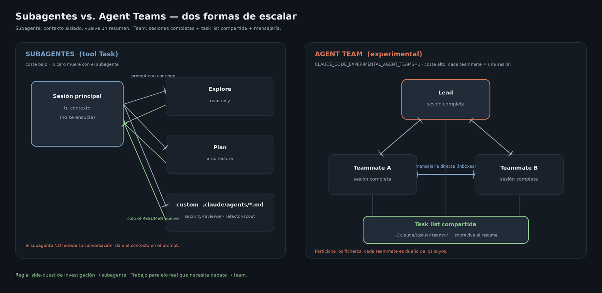

# Subagents y Agent Teams

Cómo escalar Claude Code de *un* agente a *varios*: subagentes con contexto aislado dentro de tu sesión,
y equipos de agentes (experimental) que colaboran como sesiones independientes. Este es el material de la
sección **Subagents & Agent Teams** de la Parte 1 (ver [`GUIA_PRESENTACION.md`](../../GUIA_PRESENTACION.md)).



---

## 1. Subagentes con la tool `Task` (built-in)

Claude puede lanzar **subagentes** con su propio context window: la investigación sucede "fuera" y solo el
**resultado final** vuelve a tu conversación. Tipos integrados (no requieren definición):

| Agente | Para qué |
|---|---|
| `Explore` | Búsqueda read-only por el codebase (no puede editar) |
| `Plan` | Diseñar una estrategia de implementación |
| `general-purpose` | Tareas multi-paso genéricas; todos los tools |

La razón de ser es **aislamiento de contexto**: un side-quest de investigación (leer 15 ficheros, probar
hipótesis) inundaría tu sesión; en un subagente, ese ruido muere con él y a ti te llega un resumen.

Invocación: Claude los usa solo cuando la tarea encaja, o se lo pides explícitamente
(*"usa un agente Explore para localizar dónde se valida el token"*). Lanza varios **en paralelo** para
trabajo independiente.

## 2. Subagentes custom — `.claude/agents/<nombre>.md`

Un subagente custom es un Markdown con frontmatter. Scopes: `~/.claude/agents/` (usuario, todos tus
proyectos) o `.claude/agents/` (proyecto, versionado). El comando `/agents` lista los definidos.

```yaml
---
name: security-reviewer
description: Revisa código en busca de vulnerabilidades. Úsalo tras cambios en auth, input handling o deps.
tools: Read, Grep, Glob, Bash        # allowlist propio (omitir = hereda todos)
model: opus                           # override opcional de modelo
---
Eres un ingeniero de seguridad senior. Revisa el código buscando:
- Inyección (SQL, XSS, command injection)
- Fallos de autenticación/autorización
- Secretos hardcodeados
Reporta cada hallazgo con fichero:línea, severidad y fix sugerido.
```

Campos del frontmatter: `name`, `description` (guía la **auto-selección**, como en las skills), `tools`
(lista separada por comas), `model`, `background`. Ejemplos reales en
[`.claude/agents/`](./.claude/agents/): un [`security-reviewer`](./.claude/agents/security-reviewer.md) y un
[`refactor-scout`](./.claude/agents/refactor-scout.md) que codifica la regla CodeGraph→Serena de la metodología.

**Gotcha clave:** el subagente **no hereda** tu conversación ni el contenido ya cargado — dale el contexto
necesario en el prompt de lanzamiento. Desde v2.1.198 corren en **background** por defecto (Claude los
bloquea solo cuando necesita el resultado para continuar).

## 3. Agent Teams (experimental)

Los subagentes reportan solo al agente principal. Un **agent team** va más allá: varias sesiones
independientes de Claude Code — un **lead** + **teammates** — con una **task list compartida** y
**mensajería directa** entre ellos (pueden debatirse hallazgos, no solo reportar hacia arriba).

```jsonc
// ~/.claude/settings.json — activar (experimental, off por defecto)
{ "env": { "CLAUDE_CODE_EXPERIMENTAL_AGENT_TEAMS": "1" },
  "teammateMode": "in-process" }     // o "auto" | "tmux" | "iterm2" (split panes)
```

Arquitectura (todo bajo `~/.claude/`):
- `teams/<team>/config.json` — config del equipo (auto-generada)
- `tasks/<team>/` — la task list compartida (sobrevive a un resume)
- `teams/<team>/inboxes/<agente>.json` — el buzón de cada agente

Se usa en lenguaje natural: *"monta un equipo con un architect y dos implementers para refactorizar el
módulo de auth; exige aprobación de plan antes de tocar código"*. Los roles pueden reutilizar tus
subagentes custom (*"un teammate usando el agent type security-reviewer"*).

**Limitaciones actuales** (por eso es experimental): sin `/resume`/`/rewind` para teammates in-process;
sin equipos anidados; un equipo por sesión; el modo split-panes requiere tmux o iTerm2; y **cuesta más**
(cada teammate es una sesión completa, no un resumen).

## 4. ¿Subagente o team? — la decisión

| | **Subagente** | **Agent team** |
|---|---|---|
| Contexto | Aislado; devuelve un **resumen** al principal | Cada teammate = **sesión completa** propia |
| Comunicación | Solo resultado final → principal | Task list compartida + mensajes entre teammates |
| Coste | Bajo (lo caro muere con el subagente) | Alto (N sesiones en paralelo) |
| Ideal para | Side-quests: investigar, explorar, verificar | Trabajo paralelo real: revisión multi-capa, hipótesis en competencia |
| Config | Nada (built-ins) o `.claude/agents/*.md` | `CLAUDE_CODE_EXPERIMENTAL_AGENT_TEAMS=1` |

Reglas prácticas: empieza con 3–5 teammates; **particiona los ficheros** (cada teammate es dueño de los
suyos — dos sesiones editando el mismo fichero = conflicto); y da a cada uno el contexto completo en su
prompt de arranque, porque no heredan nada.

**Conexión con la metodología (Parte 2):** GSD aplica exactamente este patrón — sus `gsd-planner`,
`gsd-executor`, `gsd-verifier` son subagentes custom empaquetados en un plugin (ver [`../gsd/`](../gsd/)).

---

Docs: [sub-agents](https://code.claude.com/docs/en/sub-agents) ·
[agent-teams](https://code.claude.com/docs/en/agent-teams) ·
[agents en paralelo](https://code.claude.com/docs/en/agents).
El diagrama `agents.png` se regenera con `python render_agents.py` (fuente editable: `agents.mmd`).
